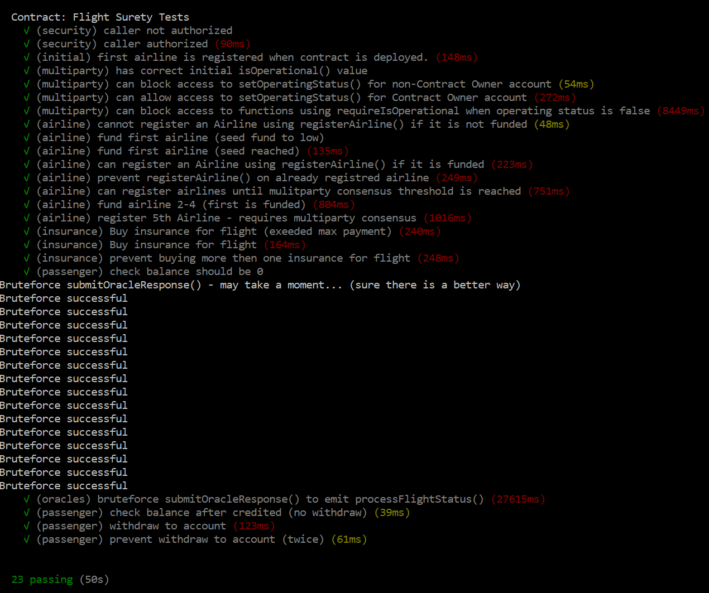

# FlightSurety

FlightSurety is a sample application project for Udacity's Blockchain course.  

## Install

This repository contains Smart Contract code in Solidity (using Truffle), tests (also using Truffle), dApp scaffolding (using HTML, CSS and JS) and server app scaffolding.

To install, download or clone the repo, then:

`npm install`
`truffle compile`

## Develop Client

To run truffle tests:

`truffle test ./test/flightSurety.js`

All 23 tests should pass.

`truffle test ./test/oracles.js`

To use the dapp:

`truffle migrate`
`npm run dapp`

To view dapp:

`http://localhost:8000`

## Develop Server

`npm run server`
`truffle test ./test/oracles.js`

## Deploy

To build dapp for prod:
`npm run dapp:prod`

Deploy the contents of the ./dapp folder

## Resources

* [How does Ethereum work anyway?](https://medium.com/@preethikasireddy/how-does-ethereum-work-anyway-22d1df506369)
* [BIP39 Mnemonic Generator](https://iancoleman.io/bip39/)
* [Truffle Framework](http://truffleframework.com/)
* [Ganache Local Blockchain](http://truffleframework.com/ganache/)
* [Remix Solidity IDE](https://remix.ethereum.org/)
* [Solidity Language Reference](http://solidity.readthedocs.io/en/v0.4.24/)
* [Ethereum Blockchain Explorer](https://etherscan.io/)
* [Web3Js Reference](https://github.com/ethereum/wiki/wiki/JavaScript-API)

## Testing the Smart Contract DAPP (Ganache / Truffle / Browser / Metamask)
Set Ganache Mnemonic to `candy maple cake sugar pudding cream honey rich smooth crumble sweet treat`  
Increase `TOTAL ACCOUNTS TO GENERATE` to `50.`  
Set `PORT NUMBER` to `8545`  
(maybe) increase the `GAS LIMIT`

After starting the application with the following commands:
`truffle compile`  
`truffle migrate`  
`npm run dapp` (separate console)  
`npm run server` (separate console) 

Start the application be started via browser `http://localhost:8000`

## Description
At the top of the application you can see the current "balance".  
This is not the account balance of the Wallet, it's the balance of the user account in the Smart Contract.  

+ Via the input field the desired insurance sum (default 0.8 ETH) up to max. 1 ETH can be entered.  
+ Via "Buy insurance" the you can buy a insurance for a certain flight.  
+ Via "Fetch Status" the status of the flight is updated via an Oracle (Server Application).  
If the "Late Airline" status is reported, the insurance sum * 1.5 is automatically transferred to the account of the user (in Smart Contract not Wallet).

+ The amount in the Smart Contract can be transferred to the user's wallet via Button "Withdraw".  

For purchasing of an insurance ("Buy unsurance" button) the current selected account (e.g. via Metamask) is used.  
Same applies to the "Withdraw" action.  

For "Fetch Status" a separate contract connection was made so that the user does not have to "pay" for these actions.
